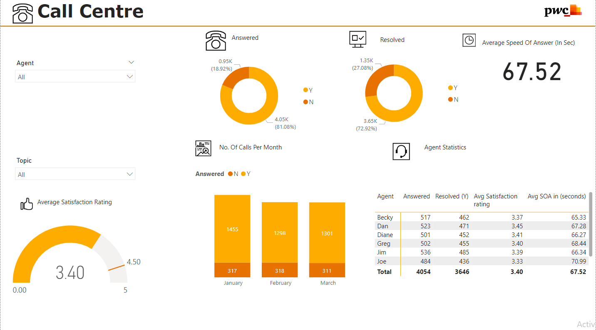
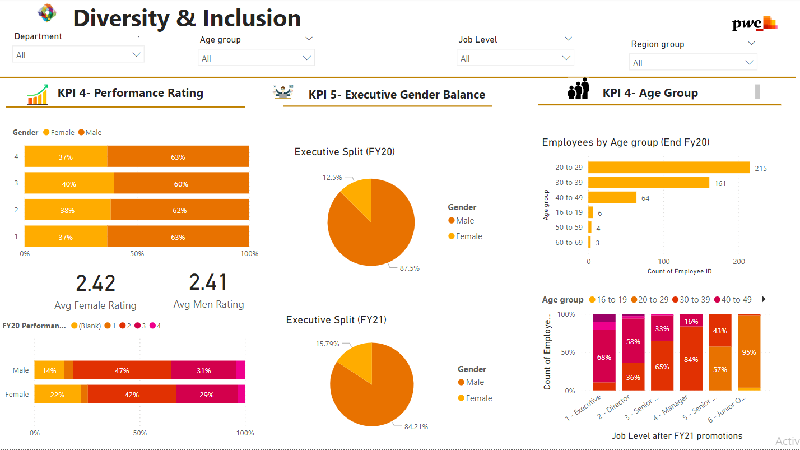
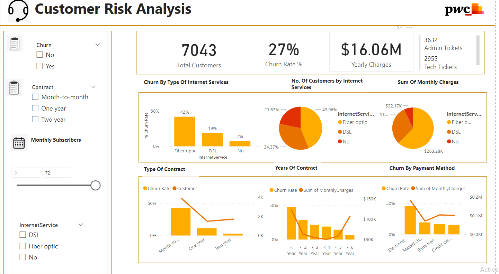

# 📊 PwC Data Analytics Job Simulation – Power BI Dashboards

## Project Overview
This project was completed as part of the PwC Data Analytics Job Simulation.  
The goal was to analyze business datasets and build interactive Power BI dashboards to help stakeholders make data-driven decisions.

The project focuses on three business scenarios:

- Call Center Performance Analysis
- Diversity & Inclusion Workforce Analysis
- Customer Churn and Risk Analysis

Each dashboard was designed to highlight key performance indicators (KPIs), operational trends, and strategic insights.

---

# ☎️ Call Center Performance Dashboard

## Objective
Analyze call center performance metrics to evaluate service quality, agent productivity, and customer satisfaction.

## Key Metrics
- Total calls answered
- Total calls resolved
- Average speed of answer (seconds)
- Customer satisfaction rating
- Calls per month

## Dashboard Insights
The dashboard helps identify:
- Call resolution performance
- Monthly call trends
- Agent-level performance statistics
- Customer satisfaction patterns

## Tools Used
- Power BI
- DAX
- Excel

## Dashboard Preview

---

# 🌍 Diversity & Inclusion Dashboard

## Objective
Analyze workforce diversity and inclusion metrics across departments and job levels.

## Key Metrics
- Gender distribution
- Executive gender balance
- Performance rating by gender
- Employee age distribution
- Job level diversity

## Dashboard Insights
This dashboard highlights:
- Gender representation across job levels
- Performance rating comparisons
- Executive leadership diversity
- Workforce age demographics

## Dashboard Preview

---

# 👥 Customer Risk & Churn Analysis Dashboard

## Objective
Analyze telecom customer data to understand churn behavior and identify risk factors affecting customer retention.

## Key Metrics
- Total customers
- Churn rate
- Yearly charges
- Internet service distribution
- Contract types

## Dashboard Insights
The analysis helps identify:
- Which internet services have the highest churn rate
- Customer churn by contract type
- Revenue contribution by service type
- Customer risk segments

## Dashboard Preview

---

# 🛠 Tools Used
- Power BI
- Excel
- DAX

---

# 📈 Project Outcome
This project demonstrates how data analytics and visualization can be applied to solve real-world business problems.  
The dashboards provide actionable insights for improving operational efficiency, workforce diversity, and customer retention.

---

# 📚 Skills Demonstrated
- Data Cleaning
- Data Visualization
- Business Analytics
- KPI Development
- Dashboard Design
- DAX Measures
